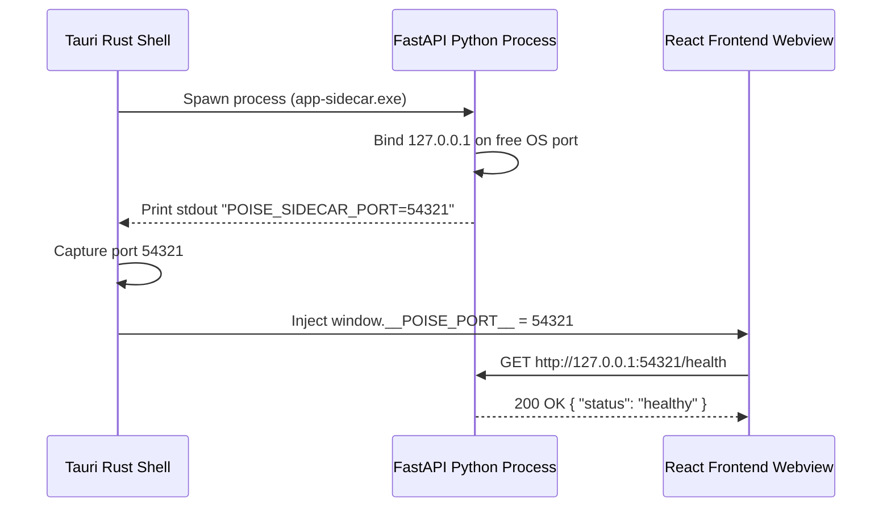

# 🏛️ System Architecture — Poise

This document details the high-level and component-level architecture of **Poise**, explaining how the desktop shell, FastAPI local sidecar process, model provider router, speech/vision pipelines, and persistence store interact.

---

## 1. Architectural Philosophy

Poise is designed as a **privacy-first, local-first desktop application with zero hosted infrastructure**.

- **No Hosted Backend:** There are no centralized servers owned or hosted by the developers. Inference happens directly on the user's hardware or via their own cloud API keys.
- **Embedded Sidecar:** The backend is compiled into a standalone Python executable (via PyInstaller) and launched directly by the desktop shell as a sidecar process.
- **Process Isolation & OS Keychain:** Process boundaries ensure security, while the desktop app handles native OS features (keychain storage, file dialogs, auto-updates, hardware discovery).

---

## 2. High-Level Component Diagram

```
┌──────────────────────────────────────────────────────────────────┐
│                      POISE DESKTOP APP (Tauri)                   │
│                                                                  │
│  ┌────────────────────┐        ┌─────────────────────────────┐   │
│  │  Frontend (React,  │        │  FastAPI Sidecar Process    │   │
│  │  Vite, Tailwind,   │◄──────►│  (Python 3.11 executable)   │   │
│  │  MediaPipe VAD)    │  IPC   │  State Machine & LiteLLM    │   │
│  └────────────────────┘        └───────────────┬─────────────┘   │
│                                                │                 │
│                    ┌───────────────────────────┼─────────────┐   │
│                    ▼                           ▼             ▼   │
│         ┌────────────────────┐     ┌─────────────────┐ ┌───────┐ │
│         │ Model Router       │     │ Speech Layer    │ │Vision │ │
│         │ (LiteLLM)          │     │ faster-whisper  │ │Media- │ │
│         │ ├─ Local (Ollama)  │     │ edge-tts/piper  │ │Pipe   │ │
│         │ └─ Cloud (BYOK)    │     └─────────────────┘ └───────┘ │
│         └────────────────────┘     ┌─────────────────┐           │
│                                    │ Sandbox & SQLite│           │
│                                    │ Docker/Subproc  │           │
│                                    └─────────────────┘           │
└──────────────────────────────────────────────────────────────────┘
```

---

## 3. Core Components

### 3.1 Desktop Shell (Tauri v2 / Rust)
- **Role:** Native application container built with Rust.
- **Responsibilities:**
  - Manages application window, system tray, and native menus.
  - Spawns and manages the lifecycle of the Python FastAPI sidecar process.
  - Parses the sidecar's stdout on boot to extract `POISE_SIDECAR_PORT=<port>`.
  - Securely stores cloud API keys in the native OS Keychain (Windows Credential Manager, macOS Keychain, Secret Service API).

### 3.2 Backend Engine (FastAPI Sidecar Process)
- **Role:** Asynchronous Python 3.11 orchestration engine.
- **Responsibilities:**
  - Binds to an OS-assigned free localhost port (`127.0.0.1:<port>`).
  - Manages session state machines (`InterviewConductor`, `IELTSSession`).
  - Performs resume and job description ingestion and structured schema extraction.
  - Coordinates real-time audio streaming (STT & TTS), vision signal processing, and answer scoring.

### 3.3 Model Provider Abstraction (LiteLLM Router)
- **Role:** Unified provider router across local and cloud LLMs.
- **Supported Backends:**
  - **Local:** Ollama (`http://localhost:11434`), Llama.cpp server, vLLM.
  - **Cloud (BYOK):** OpenAI (GPT-4o, GPT-4o-mini), Anthropic (Claude 3.5 Sonnet), Google Gemini (Gemini 1.5 Pro/Flash), Groq, DeepSeek.
- **Fallback Logic:** If local inference times out or fails, gracefully falls back to structured heuristic parsers or alternate user-configured models.

### 3.4 Speech & Vision Pipeline
- **Speech-to-Text (STT):** `faster-whisper` (CTranslate2 backend) running locally for real-time and batch voice transcription.
- **Text-to-Speech (TTS):** `edge-tts` (online neural TTS) and `piper` / `phonemizer` (offline TTS) for persona audio generation.
- **Voice Activity Detection (VAD):** Silero VAD / Web Audio API for detecting user speech start/stop boundaries.
- **Vision Signals:** MediaPipe Face Mesh running client-side to compute non-verbal behavioral metrics (head tilt, eye contact ratio, blink frequency, facial expression variability).

### 3.5 Sandboxed Coding Execution
- **Role:** Executes candidate code during technical rounds.
- **Execution Modes:**
  - **Docker Runner:** Isolated container environment with strict memory/CPU caps and network isolation.
  - **Subprocess Sandbox:** Fallback restricted process execution for lightweight environments.

### 3.6 Data Layer & Persistence
- **Relational Storage:** SQLite database (`poise.db`) managed via SQLAlchemy 2.0 ORM and Alembic migrations.
- **Vector Storage:** Embedded ChromaDB for local retrieval-augmented generation (RAG) on resume context and past question history.
- **Export Engine:** PyMuPDF & ReportLab for generating diagnostic PDF summary reports.

---

## 4. Sidecar Startup Protocol



---

## 5. Security & Data Privacy

1. **Zero-Telemetry Default:** LiteLLM telemetry and analytics are disabled via `DISABLE_LITELLM_TELEMETRY=True`.
2. **Local Audio & Frame Processing:** Camera frames and mic audio are processed locally; raw media is never transmitted to third parties.
3. **Encrypted Key Storage:** Cloud API keys (OpenAI, Anthropic, Gemini, Groq) are kept strictly in system keychain memory and never stored in plain text configuration files.
