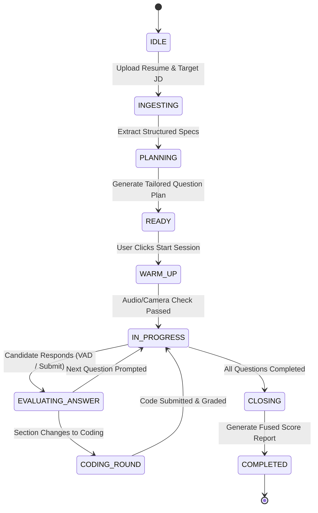

# ⚙️ Technical Breakdown: How Poise Works

This document explains the internal mechanisms, algorithms, state machines, and scoring engines that power **Poise**.

---

## 1. The Interview Lifecycle & State Machine

Every interview session (Behavioral, Technical, or Mixed) is governed by a finite state machine managed by `InterviewConductor`.

---

## 2. Ingestion & Question Planning

### 2.1 Structured Extraction
1. **File Parsing:** PyMuPDF (`fitz`) extracts raw text from `.pdf` resumes; `python-docx` handles `.docx`.
2. **Schema Mapping:** The raw text is passed to `ResumeParser` and `JDParser`. LLM output is validated into Pydantic models (`ResumeData`, `JobDescription`). If LLM output fails schema validation, a heuristic fallback parser kicks in to ensure uninterrupted user flow.

### 2.2 Deterministic Time Budgeting
Before asking LLM to generate questions, `default_section_time_budgets()` calculates section lengths deterministically using the **largest-remainder method**.

For example, a 45-minute interview reserving 3m warm-up and 2m closing leaves 40m total:
- **Behavioral (weight 1.0):** 10 minutes
- **Technical (weight 1.4):** 14 minutes
- **Coding (weight 1.8):** 16 minutes

This guarantees sections sum up to *exactly* 45 minutes without timing drift.

---

## 3. The Multi-Modal Score Fusion Engine

Poise uses a **Weighted Fusion Engine** (`ScoreFusionEngine`) to synthesize distinct performance dimensions into a final score (0 - 100).

$$\text{Final Score} = \sum_{i \in \text{Available}} w_i \cdot S_i$$

### 3.1 Score Dimensions & Weights

| Dimension | Default Weight | Data Sources |
|---|---|---|
| **Content Quality ($S_{\text{content}}$)** | **35%** | STAR method compliance, depth of technical explanation, JD skill alignment. |
| **Delivery Confidence ($S_{\text{conf}}$)** | **25%** | MediaPipe facial signals (eye contact, posture stability, expression variance) + speech pause metrics. |
| **Technical & Code Skill ($S_{\text{code}}$)** | **25%** | Test case pass rate, algorithmic efficiency, code readability in sandbox. |
| **Communication ($S_{\text{comm}}$)** | **15%** | WPM (words per minute pace), filler word count (um, ah, like), vocal clarity. |

### 3.2 Dynamic Weight Renormalization
If a dimension is unavailable (e.g., candidate turned off webcam or session had no coding round), `ScoreFusionEngine` **renormalizes** the remaining weights so they sum to $1.0$ (100%), ensuring scores are never unfairly zeroed out:

$$w_j' = \frac{w_j}{\sum_{k \in \text{Active}} w_k}$$

---

## 4. IELTS Speaking Evaluation Engine

The **IELTS Speaking Mode** follows official British Council / IDP guidelines:

### 4.1 Test Structure
- **Part 1 (4-5 mins):** General questions on familiar topics (home, work, studies, hobbies).
- **Part 2 (3-4 mins):** Cue Card prompt. Candidate gets 1 minute preparation time, followed by a uninterrupted 2-minute speech.
- **Part 3 (4-5 mins):** In-depth abstract discussion expanding on Part 2 themes.

### 4.2 IELTS Criteria Scoring
Transcripts and audio features are evaluated against four criteria on a 1-9 band scale:
1. **Fluency and Coherence (FC):** Hesitation frequency, discourse markers, self-correction rate.
2. **Lexical Resource (LR):** Idiomatic phrase usage, vocabulary range, collocations.
3. **Grammatical Range and Accuracy (GRA):** Complex sentence ratio, tense consistency, error count.
4. **Pronunciation (P):** Phonetic clarity, intonation patterns, word stress.

The overall IELTS Speaking Band is calculated as the average of the 4 criteria rounded to the nearest half-band.

---

## 5. Sandboxed Code Execution Engine

Technical coding rounds run inside `SandboxRunner`:
- **Isolation:** Code is executed in a restricted subprocess with `timeout=10s` or inside a lightweight Docker container.
- **Evaluation Metrics:**
  - **Correctness:** Automated unit test verification against public and hidden test cases.
  - **Code Quality:** Static analysis for cyclomatic complexity and clean coding standards.
  - **LLM Review:** Detailed code review highlighting time/space complexity ($O(N)$) and potential edge cases.
